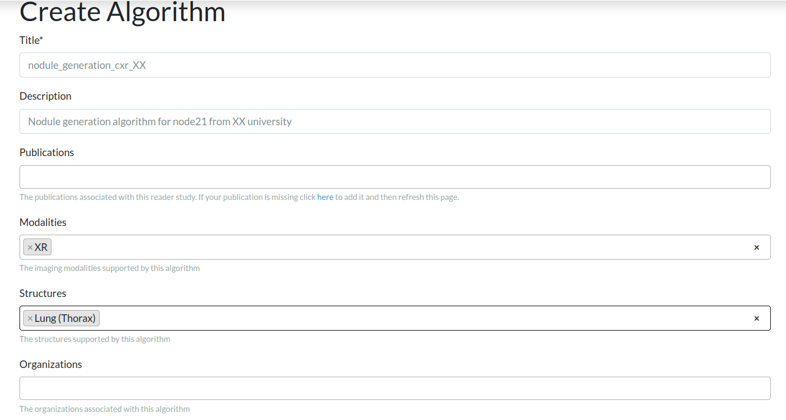
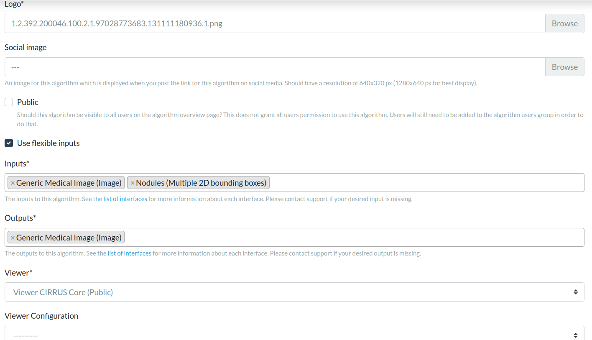
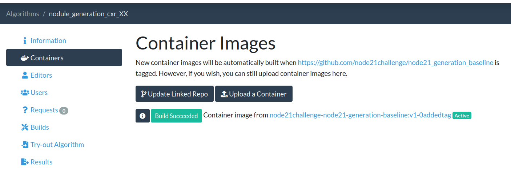
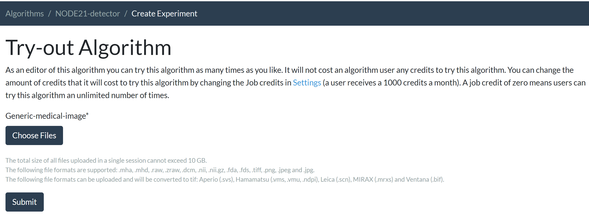
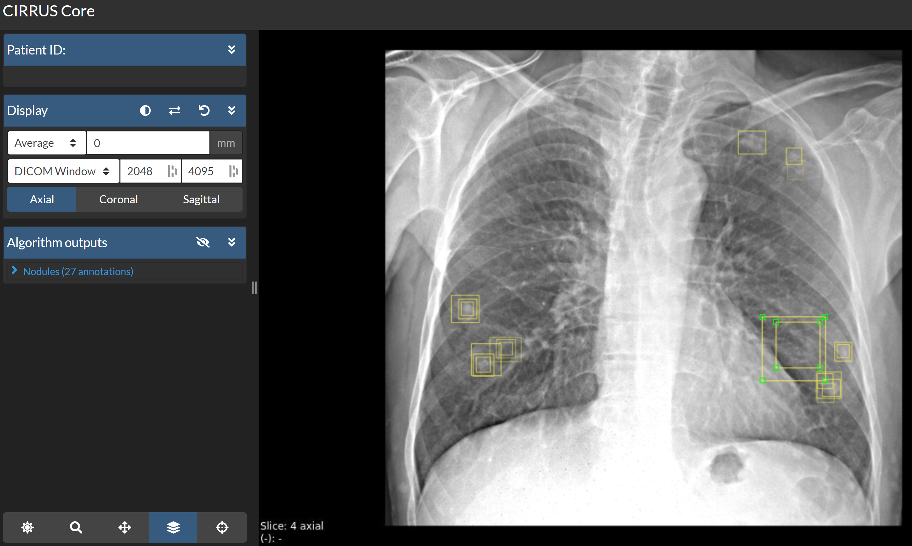

# Nodule Generation Algorithm

This codebase implements a simple baseline model, by following the main steps in the [paper](https://geertlitjens.nl/publication/litj-10-a/litj-10-a.pdf) published by Litjens et al. for nodule generation track in [NODE21](https://node21.grand-challenge.org/). It contains all necessary files to build a docker image which can be submitted as an algorithm on the [grand-challenge](https://www.grand-challenge.org) platform. Participants in the generation track can use this codebase as a template to understand how to create their own algorithm for submission.

To serve this algorithm in a docker container compatible with the requirements of grand-challenge, 
we used [evalutils](https://github.com/comic/evalutils) which provides methods to wrap your algorithm in Docker containers. 
It automatically generates template scripts for your container files, and creates commands for building, testing, and exporting the algorithm container.
We adapted this template code for our algorithm by following the
[general tutorial on how to create a grand-challenge algorithm](https://grand-challenge.org/blogs/create-an-algorithm/). 

We also explain this template repository, and how to set up your docker container in [this video](https://www.youtube.com/watch?v=0MpWOGXT8h8).
Before diving into the details of this template code we recommend readers have the pre-requisites installed and have cloned this repository as described below:

## Prerequisites
* [Docker](https://www.docker.com/get-started)
* [evalutils](https://github.com/comic/evalutils)

The code in this repository is based on docker and evalutils.  

**Windows Tip**: For participants using Windows, it is highly recommended to 
install [Windows Subsystem for Linux (WSL)](https://docs.microsoft.com/en-us/windows/wsl/install-win10) 
to work with Docker on a Linux environment within Windows. Please make sure to install **WSL 2** by following the instructions on the same page. 
The alternative is to work purely out of Ubuntu, or any other flavor of Linux.
Also, note that the basic version of WSL 2 does not come with GPU support. 
Please watch the [official tutorial](https://www.youtube.com/watch?v=PdxXlZJiuxA) 
by Microsoft on installing WSL 2 with GPU support.

Please clone the repository as follows:
```python
git clone git@github.com:node21challenge/node21_generation_baseline.git
```


##### Table of Contents  
[An overview of the baseline algorithm](#algorithm)  
[Configuring the Docker File](#dockerfile)  
[Export your algorithm container](#export)   
[Submit your algorithm](#submit)  

<a name="algorithm"/>

## An overview of the baseline algorithm
The baseline nodule generation algorithm is based on the [paper](https://geertlitjens.nl/publication/litj-10-a/litj-10-a.pdf) published by Litjens et al.. The main file executed by the docker container is [*process.py*](https://github.com/node21challenge/node21_generation_baseline/blob/main/process.py). 


## Input and output interfaces
The algorithm needs to generate nodules on a given chest X-ray image (CXR) at requested locations (given in a .json file) and return a CXR after placing nodules. The nodule generation algorithm takes as input a chest X-ray (CXR) and a nodules.json file, which holds the coordinates location of where to generate the nodules. The algorithm reads the input :
* CXR at ```"/input/<uuid>.mha"```
* nodules.json file at ```"/input/nodules.json"```.

and writes the output to:
```/output/<uuid>.mha```

The nodules.json file contains the predicted bounding box locations and associated nodule likelihoods (probabilities). 
This file is a dictionary and contains multiple 2D bounding boxes coordinates 
in [CIRRUS](https://comic.github.io/grand-challenge.org/components.html#grandchallenge.components.models.InterfaceKind.interface_type_annotation) 
compatible format. The coordinates are expected in milimiters when spacing information is available. 
An example nodules.json file is as follows:

```python
{
    "type": "Multiple 2D bounding boxes",
    "boxes": [
        {
        "corners": [
            [ 92.66666412353516, 136.06668090820312, 0],
            [ 54.79999923706055, 136.06668090820312, 0],
            [ 54.79999923706055, 95.53333282470703, 0],
            [ 92.66666412353516, 95.53333282470703, 0]
        ]},
        {
        "corners": [
            [ 92.66666412353516, 136.06668090820312, 0],
            [ 54.79999923706055, 136.06668090820312, 0],
            [ 54.79999923706055, 95.53333282470703, 0],
            [ 92.66666412353516, 95.53333282470703, 0]
        ]}
    ],
    "version": { "major": 1, "minor": 0 }
}
```
The implementation of the algorithm inference in process.py is straightforward (and must be followed by participants creating their own algorithm): 
load the nodules.json file in the [*__init__*](https://github.com/node21challenge/node21_generation_baseline/blob/main/process.py#L25) function of the class, 
and implement a function called [*predict*](https://github.com/node21challenge/node21_generation_baseline/blob/main/process.py#L44) 
to generate nodules on a given CXR image. 

The function [*predict*](https://github.com/node21challenge/node21_generation_baseline/blob/main/process.py#L44) is run by 
evalutils when the [process](https://github.com/node21challenge/node21_generation_baseline/blob/main/process.py#L95) function is called.

💡 To test this container locally without a docker container, you should the **execute_in_docker** flag to 
False - this sets all paths to relative paths. You should set it back to **True** when you want to switch back to the docker container setting.

### Operating on a 3D image
For the sake of time efficiency in the evaluation process of [NODE21](https://node21.grand-challenge.org/), 
the submitted algorithms to [NODE21](https://node21.grand-challenge.org/) are expected to operate on a 3D image which consists of multiple CXR images 
stacked together. The algorithm should go through the slices (CXR images) one by one and process them individually, 
as shown in [*predict*](https://github.com/node21challenge/node21_generation_baseline/blob/main/process.py#L44). 
When outputting results, the third coordinate of the bounding box in nodules.json file is used to identify the CXR from the stack. 
If the algorithm processes the first CXR image in 3D volume, the z coordinate output should be 0, if it processes the third CXR image, it should be 2, etc. 

<a name="dockerfile"/>

### Configure the Docker file

<a name="export"/>

### Build, test and export your container
1. Switch to the correct algorithm folder at algorithms/nodulegeneration. To test if all dependencies are met, you can run the file build.bat (Windows) / build.sh (Linux) to build the docker container. 
Please note that the next step (testing the container) also runs a build, so this step is not necessary if you are certain that everything is set up correctly.

    *build.sh*/*build.bat* files will run the following command to build the docker for you:
    ```python 
   
    docker build -t nodulegenerator .
    ```

2. To test the docker container to see if it works as expected, *test.sh*/*test.bat* will run the container on images provided in  ```test/``` folder, 
and it will check the results (*results.json* produced by your algorithm) against ```test/expected_output.json```. 
Please update your ```test/expected_output.json``` according to your algorithm result when it is run on the test data. 
   ```python
   . ./test.sh
   ```
    If the test runs successfully you will see the message **Tests successfully passed...** at the end of the output.

    Once you validated that the algorithm works as expected, you might want to simply run the algorithm on the test folder 
    and check the output images for yourself.  If you are on a native Linux system you will need to create a results folder that the 
    docker container can write to as follows (WSL users can skip this step) (Note that $SCRIPTPATH was created in the previous test script).
    ```python
   mkdir $SCRIPTPATH/results
   chmod 777 $SCRIPTPATH/results
   ```
   To write the output of the algorithm to the results folder use the following command (note that $SCRIPTPATH was created in the previous test script): 
   ```python
   docker run --rm --memory=11g -v $SCRIPTPATH/test:/input/ -v $SCRIPTPATH/results:/output/ nodulegenerator
   ```
   

4. Run *export.sh*/*export.bat* to save the docker image which runs the following command:
   ```python
    docker save nodulegenerator | gzip -c > nodulegenerator.tar.gz
   ```
   
 ### Submit your algorithm  
Please make sure all steps described above work as expected before proceeding.  Ensure also that you have an account on grand-challenge.org and that you are a [verified user](https://grand-challenge.org/documentation/account-verification/) there.
 
 Once you test that your docker container runs as expected, you are ready to submit! Let us walk you through the steps you need to follow to upload and submit your algorithm to [NODE21](https://node21.grand-challenge.org/) generation track:

1. In order to submit your algorithm, you first have to create an algorithm entry for your docker container [here](https://grand-challenge.org/algorithms/create/).
   * Please choose a title and description for your algorithm and enter the modalities and structure information as in the example below.
      

   * Scrolling down the page, you will see that you need to enter further information:
   * Select a logo to represent your algorithm (preferably square image)
   * For the interfaces, please select *Generic Medical Image (Image)* and *Nodules (Multiple 2D Bounding Boxes)* as Inputs and *Generic Medical Image (Image)* as Outputs. 
   * Do not forget to pick the workstation *Viewer CIRRUS Core (Public)*.  
   
   
  
   * At the bottom of the page, indicate that you would like your Docker image to use GPU and how much memory it needs
   
   * Don't forget to click the Save button at the bottom of the page to create your algorithm.  You will then see your algorithm page as shown below.
   
   
2. After creating your algorithm, you need to attach a docker container to it so it becomes functional.  There are 2 ways to do this:
   * OPTION 1: If you already built the tar.gz file as described above then you can upload this file directly
   * OPTION 2: You can provide your repository details and the file will be built by Grand-Challenge from your repository code. Please bear in mind that the root of the github repository must contain the dockerfile, the licence, the gitattributes in order to build the image for you. Further, you must have admin rights to the repository so that you can give permission for Grand Challenge to install an app there.
   
   For either option, first choose "Containers" on the left menu of your screen as shown below, then follow the detailed steps for your option below.
   
   
    **OPTION 1:** If you would like to upload your docker container directly, click on "upload a Container" button, and upload your tar.gz file. 
    You can also later overwrite your container by uploading a new one (ie. you should not create a whole new algorithm if you make some code changes):
    Please note that it can take a while until the container becomes active. (Status will change from "Ready: False" to "Active")  Check back later or refresh the URL after some time.

    **OPTION 2:** If you would like to submit your repository and let grand-challenge build the docker image for you, click on "Link Github Repo".
    Your repo will be listed in the dropdown box only if it has the Grand-Challenge app already installed.  
    Usually this is not the case to begin with, so you should click on "link a new Github Repo".  
    This will guide you through the installation of the Grand-challenge app in your repository.
    
    
    After the installation of the app in your repository is complete you should be automatically returned to the Grand Challenge page shown above, 
    where you will find your repository now in the dropdown list.
    (In case you are not automatically returned there you can [find your algorithm](https://grand-challenge.org/algorithms/) and click "Link Github Repo" again)
    Select your repository from the dropdown list and click "Save"
    

    Finally, you need to tag your repository, this will trigger Grand-Challenge to start building the docker container.
    Please note that it can take a little while for Grand-Challenge to start building your container, and some further time to complete the build.  Check back later or refresh the URL after some time.
      
3. **Both OPTION1 and OPTION2 can continue from here:** Once your algorithm is ready to run you will see the status "Active" beside it as shown below
    
    Once it becomes active, we suggest that you try out the algorithm to verify everything works as expected. For this, please click on *Try-out Algorithm* tab, and upload a *Generic Medical Image*. You could upload the image provided here in the test folder since it is a 3D image (CXRs are stacked together) which is the expected format.
  
   OPTIONAL: You could look at the results of your algorithm: click on the *Results*, and *Open Result in Viewer* to visualize the results. You would be directed to CIRRUS viewer, and the results will be visualized with the predicted bounding boxes on chest x-ray images as below. You could move to the next and previous slice (slice is a chest x-ray in this case) by clicking on the up and down arrow in the keyboard.
     

4. You have created and tested your Grand-Challenge Algorithm!!  The last step is to submit your algorithm to the NODE21 challenge to have it evaluated and get your spot on the leaderboard!
   Go to the [NODE21 submission page](https://node21.grand-challenge.org/evaluation/challenge/submissions/create/), and click on the track where you want to participate
   ("Generation Track Experimental Test Set" OR "Generation Track Final Test Set").  
   **Only one submission to the Final Test Set is allowed so please use the Experimental Test Set for your first testing efforts!**
   Choose your algorithm name from the dropdown list and click on "Save"
5. Allow some time for the evaluation to be processed.  It may not start immediately depending on what hardware resources are available at the time. 
   Your result will appear on the [leaderboard page](https://node21.grand-challenge.org/evaluation/challenge/leaderboard/) (make sure to select the track where you submitted).
   If you do not see your result after 24 hours please contact us via email or the forum and provide your algorithm name and date/time you submitted in Central European Time.
   

### Re-submitting if you make improvements
If you already have an algorithm on Grand-Challenge you do NOT need to make a new one whenever you have made some improvements or changes to your code. 
To re-submit, first just update your existing algorithm as follows:

If you used **OPTION 1** in previous steps and uploaded a tar.gz file then you can now upload a new tar.gz file which will overwrite the old one.  Find your algorithm at [https://grand-challenge.org/algorithms/](https://grand-challenge.org/algorithms/).  Click on "Containers", and "upload a container" as before.  Allow some time for the algorithm to become "Active" as previously. 

If you used **OPTION 2** in previous steps and allowed Grand-Challenge to build from your repository then a new build will start automatically whenever you tag your repository.  So just tag the repository and allow some time for the new build to start and complete, it will then show the "Active" label.

**OPTION 1 AND OPTION 2**:  Whichever option you use, once your algorithm is updated you need to resubmit to NODE21, this does not happen automatically!  Visit the [NODE21 submission page](https://node21.grand-challenge.org/evaluation/challenge/submissions/create/) and proceed to submit to your chosen track as before. 

