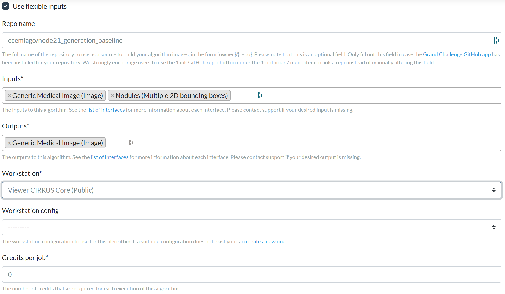
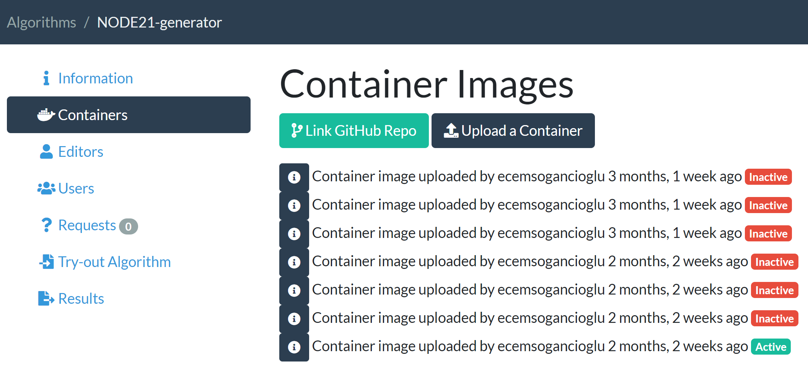
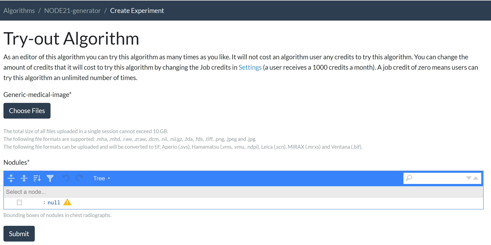
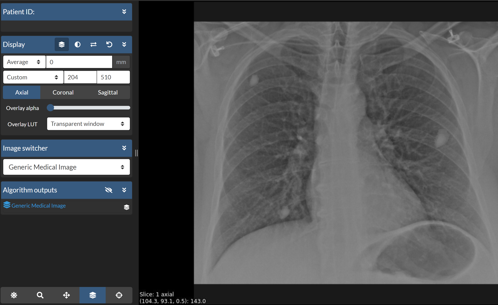

# Nodule Generation Algorithm

This codebase implements a simple baseline model, by following the main steps in the [paper](https://geertlitjens.nl/publication/litj-10-a/litj-10-a.pdf) published by Litjens et al. for nodule generation track in [NODE21](https://node21.grand-challenge.org/). It contains all necessary files to build a docker image which can be submitted as an algorithm on the [grand-challenge](https://www.grand-challenge.org) platform. Participants in the generation track can use this codebase as a template to understand how to create their own algorithm for submission.

To serve this algorithm in a docker container compatible with the requirements of grand-challenge, 
we used [evalutils](https://github.com/comic/evalutils) which provides methods to wrap your algorithm in Docker containers. 
It automatically generates template scripts for your container files, and creates commands for building, testing, and exporting the algorithm container.
We adapted this template code for our algorithm by following the
[general tutorial on how to create a grand-challenge algorithm](https://grand-challenge.org/blogs/create-an-algorithm/). 

We also explain this template repository, and how to set up your docker container in [this video](https://www.youtube.com/watch?v=0MpWOGXT8h8).
Before diving into the details of this template code we recommend readers have the pre-requisites installed and have cloned this repository as described below:

## Prerequisites
* [Docker](https://www.docker.com/get-started)
* [evalutils](https://github.com/comic/evalutils)

The code in this repository is based on docker and evalutils.  

**Windows Tip**: For participants using Windows, it is highly recommended to 
install [Windows Subsystem for Linux (WSL)](https://docs.microsoft.com/en-us/windows/wsl/install-win10) 
to work with Docker on a Linux environment within Windows. Please make sure to install **WSL 2** by following the instructions on the same page. 
The alternative is to work purely out of Ubuntu, or any other flavor of Linux.
Also, note that the basic version of WSL 2 does not come with GPU support. 
Please watch the [official tutorial](https://www.youtube.com/watch?v=PdxXlZJiuxA) 
by Microsoft on installing WSL 2 with GPU support.

Please clone the repository as follows:
```python
git clone git@github.com:node21challenge/node21_generation_baseline.git
```


##### Table of Contents  
[An overview of the baseline algorithm](#algorithm)  
[Configuring the Docker File](#dockerfile)  
[Export your algorithm container](#export)   
[Submit your algorithm](#submit)  

<a name="algorithm"/>

## An overview of the baseline algorithm
The baseline nodule generation algorithm is based on the [paper](https://geertlitjens.nl/publication/litj-10-a/litj-10-a.pdf) published by Litjens et al.. The main file executed by the docker container is [*process.py*](https://github.com/node21challenge/node21_generation_baseline/blob/main/process.py). 


## Input and output interfaces
The algorithm needs to generate nodules on a given chest X-ray image (CXR) at requested locations (given in a .json file) and return a CXR after placing nodules. The nodule generation algorithm takes as input a chest X-ray (CXR) and a nodules.json file, which holds the coordinates location of where to generate the nodules. The algorithm reads the input :
* CXR at ```"/input/<uuid>.mha"```
* nodules.json file at ```"/input/nodules.json"```.

and writes the output to:
```/output/<uuid>.mha```

The nodules.json file contains the predicted bounding box locations and associated nodule likelihoods (probabilities). 
This file is a dictionary and contains multiple 2D bounding boxes coordinates 
in [CIRRUS](https://comic.github.io/grand-challenge.org/components.html#grandchallenge.components.models.InterfaceKind.interface_type_annotation) 
compatible format. The coordinates are expected in milimiters when spacing information is available. 
An example nodules.json file is as follows:

```python
{
    "type": "Multiple 2D bounding boxes",
    "boxes": [
        {
        "corners": [
            [ 92.66666412353516, 136.06668090820312, 0],
            [ 54.79999923706055, 136.06668090820312, 0],
            [ 54.79999923706055, 95.53333282470703, 0],
            [ 92.66666412353516, 95.53333282470703, 0]
        ]},
        {
        "corners": [
            [ 92.66666412353516, 136.06668090820312, 0],
            [ 54.79999923706055, 136.06668090820312, 0],
            [ 54.79999923706055, 95.53333282470703, 0],
            [ 92.66666412353516, 95.53333282470703, 0]
        ]}
    ],
    "version": { "major": 1, "minor": 0 }
}
```
The implementation of the algorithm inference in process.py is straightforward (and must be followed by participants creating their own algorithm): 
load the nodules.json file in the [*__init__*](https://github.com/node21challenge/node21_generation_baseline/blob/main/process.py#L25) function of the class, 
and implement a function called [*predict*](https://github.com/node21challenge/node21_generation_baseline/blob/main/process.py#L44) 
to generate nodules on a given CXR image. 

The function [*predict*](https://github.com/node21challenge/node21_generation_baseline/blob/main/process.py#L44) is run by 
evalutils when the [process](https://github.com/node21challenge/node21_generation_baseline/blob/main/process.py#L95) function is called.

💡 To test this container locally without a docker container, you should the **execute_in_docker** flag to 
False - this sets all paths to relative paths. You should set it back to **True** when you want to switch back to the docker container setting.

### Operating on a 3D image
For the sake of time efficiency in the evaluation process of [NODE21](https://node21.grand-challenge.org/), 
the submitted algorithms to [NODE21](https://node21.grand-challenge.org/) are expected to operate on a 3D image which consists of multiple CXR images 
stacked together. The algorithm should go through the slices (CXR images) one by one and process them individually, 
as shown in [*predict*](https://github.com/node21challenge/node21_generation_baseline/blob/main/process.py#L44). 
When outputting results, the third coordinate of the bounding box in nodules.json file is used to identify the CXR from the stack. 
If the algorithm processes the first CXR image in 3D volume, the z coordinate output should be 0, if it processes the third CXR image, it should be 2, etc. 

<a name="dockerfile"/>

### Configure the Docker file

<a name="export"/>

### Build, test and export your container
1. Switch to the correct algorithm folder at algorithms/nodulegeneration. To test if all dependencies are met, you can run the file build.bat (Windows) / build.sh (Linux) to build the docker container. 
Please note that the next step (testing the container) also runs a build, so this step is not necessary if you are certain that everything is set up correctly.

    *build.sh*/*build.bat* files will run the following command to build the docker for you:
    ```python 
   
    docker build -t nodulegenerator .
    ```

2. To test the docker container to see if it works as expected, *test.sh*/*test.bat* will run the container on images provided in  ```test/``` folder, 
and it will check the results (*results.json* produced by your algorithm) against ```test/expected_output.json```. 
Please update your ```test/expected_output.json``` according to your algorithm result when it is run on the test data. 
   ```python
   . ./test.sh
   ```
    If the test runs successfully you will see the message **Tests successfully passed...** at the end of the output.

    Once you validated that the algorithm works as expected, you might want to simply run the algorithm on the test folder 
    and check the output images for yourself.  If you are on a native Linux system you will need to create a results folder that the 
    docker container can write to as follows (WSL users can skip this step) (Note that $SCRIPTPATH was created in the previous test script).
    ```python
   mkdir $SCRIPTPATH/results
   chmod 777 $SCRIPTPATH/results
   ```
   To write the output of the algorithm to the results folder use the following command (note that $SCRIPTPATH was created in the previous test script): 
   ```python
   docker run --rm --memory=11g -v $SCRIPTPATH/test:/input/ -v $SCRIPTPATH/results:/output/ nodulegenerator
   ```
   

4. Run *export.sh*/*export.bat* to save the docker image which runs the following command:
   ```python
    docker save nodulegenerator | gzip -c > nodulegenerator.tar.gz
   ```
   
### Submit your algorithm
Details of how to create an algorithm on grand-challenge and submit it to the node21 challenge will be added here soon.  
Please make sure all steps described above work as expected before proceeding. Ensure also that you have an account on grand-challenge.org and that you are a [verified user](https://grand-challenge.org/documentation/account-verification/) there.

<!---  
 <a name="submit"/>

    
 ### Submit your algorithm
 You could submit your algorithm in two different ways: by uploading your docker container (your .tar.gz file), or by submitting your github repository.
 Once you test that your docker container runs as expected, you are ready to submit! Let us walk you through the steps you need to follow to upload and submit your algorithm to [NODE21](https://node21.grand-challenge.org/) generation track:

1. In order to submit your docker container, you first have to create an algorithm entry for your docker container [here](https://grand-challenge.org/algorithms/create/).
   * Please choose a title for your algorithm and add a (squared image) logo. Enter the modalities and structure information as in the example below.
      

    * Scrolling down the page, you will see that you need to enter further information:
    * Enter the URL of your GitHub repository which must be public, contain all your code and an [Apache 2.0 license](https://www.apache.org/licenses/LICENSE-2.0). When entering the repo name in algorithm-creation do not enter a full URL, only the part that comes after github.com/. For example if your github url is https://github.com/ecemlago/node21_generation_baseline/, please enter the field as *ecemlago/node21_generation_baseline*.
    *  For the interfaces, please select *Generic Medical Image (Image)* and *Nodules (Multiple 2D Bounding Boxes)* as Inputs and *Generic Medical Image (Image)* as Outputs. 
    *  Do not forget to pick the workstation as *Viewer CIRRUS Core (Public)*. 
      
  
2. After saving it, you can either upload your docker container (.tar.gaz) or you can let grand-challenge build your algorithm container from your github repository.

     OPTION 1: If you would like to upload your docker container directly, please click on "upload a Container" button, and upload your container. You can also later overwrite your container by uploading a new one. That means that when you make changes to your algorithm, you could overwrite your container and submit the updated version of your algorithm to node21:
    
    
    OPTION 2: If you would like to submit your repository and let grand-challenge build the docker image for you, please click on "Link github repo" and select your repository to give repository access to grand-challenge to build your algorithm. Once this is done, you should tag the repo to kick off the build process. Please bear in mind that, the root of the github repository must contain the dockerfile, the licence, the gitattributes in order to build the image for you. Further, you must have admin rights to the repository so that you can give permission for GC to install an app there.
    

3. OPTIONAL: Please note that it can take a while (several minutes) until the container becomes active. Once it becomes active, we suggest that you try out the algorithm to verify everything works as expected. For this, please click on *Try-out Algorithm* tab, and upload a *Generic Medical Image* and paste your *nodules.json* file. To paste your nodules.json content, please click on tree and select "code" then paste the content of your json file. You could upload the image and nodules.json given in the test folder which represents how test data would look like during evaluation.
  
4. OPTIONAL: You could look at the results of your algorithm: click on the *Results*, and *Open Result in Viewer* to visualize the results. You would be directed to CIRRUS viewer, and the results will be visualized with the predicted bounding boxes on chest x-ray images as below. You could move to the next and previous slice (slice is a chest x-ray in this case) by clicking on the up and down arrow in the keyboard.
    

5. Go to the [NODE21](https://node21.grand-challenge.org/evaluation/generation/submissions/create/) submission page, and submit your solution to the generation track by choosing your algorithm.
   
-->


